# Tutorial used dashboard Gonstack - Create instance

## Create keypair
#### b1: create a SSH keypair for connecting to instances (your pc)

```
# ssh-keygen -q -N ""
# cat ~/.ssh/id_rsa.pub
ssh-rsa AAAAB3NzaC1yc2EAAAADAQABAAABAQCayccOIiqvuUBELcaOQ/RYSsQsXIqOeid03vpeuiPNTS9NxsGEzm65Jhg38KMjrt+C88lxNBLWeBNj2FbH8lCdamKnrYPo/DYD+07rcWYXC8g1kđkadnd/LnEKDlBkE3u825g6QQ3nJwZlj/1dUv92AZYKj02MOCLKHo46Q9VFXQ4mjp1U6Nyy1yJMvCtHzi3c8sZh6BIxTgrOnb/20YCVN7AvphgPQgL01C+Kk89mLmlZntqni6MnbnUq0Mgq5tmXLats/H8zHtjmWOGOLlbZBSGzj8xebfgn5HmaGkYOsFk6Pt81prM1yKsnC52sEZ7YXYB4x google@iGo.local
```
#### b2: import public key rsa to dashboard Gonstack
- On dashboard select Project -> Compute -> Key Pairs -> Import Public key

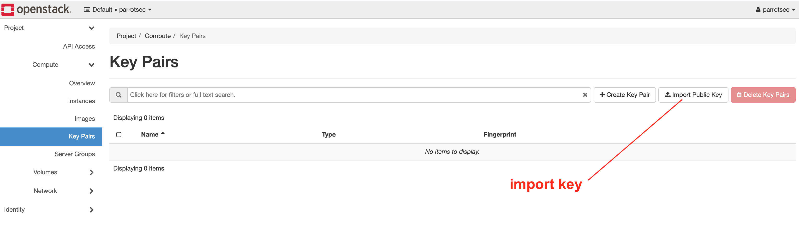

- Fill out the form Import Public key

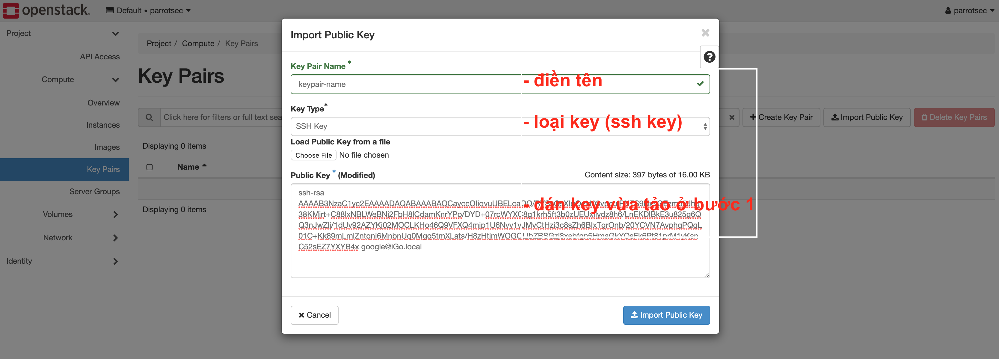


## Create volume boot a image
#### b1: create a volume
- On dashboard select Project -> Volumes -> Volumes -> Create Volume (Fill out the form)
 -	 note: choose the size of the baby, the expansion will be faster.

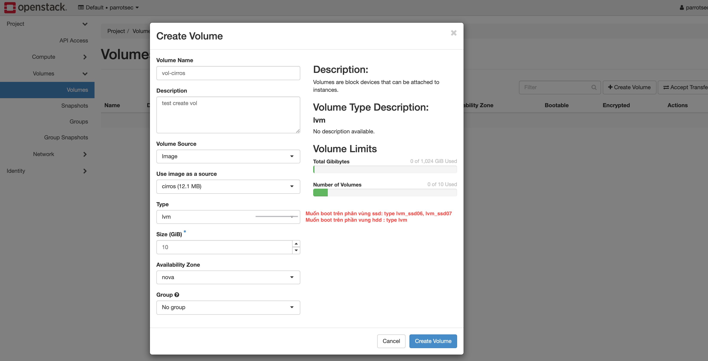

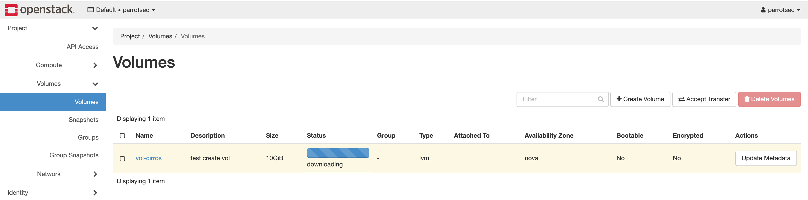

- then, launch instance from vol has create

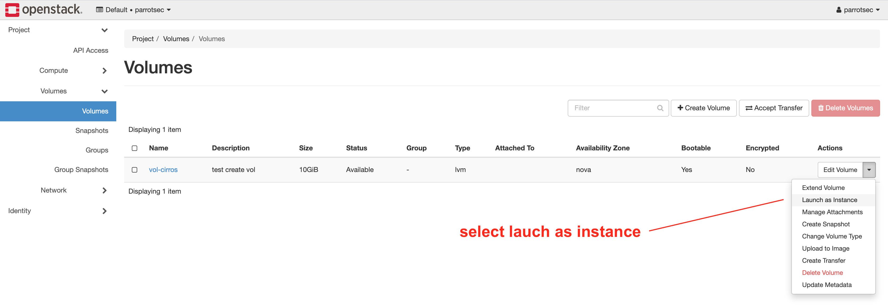

- step by step Fill out the form
b1: instance info

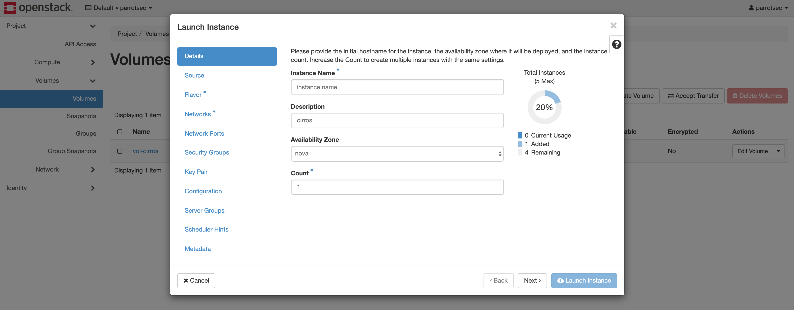

b2: disk source (vol has create)

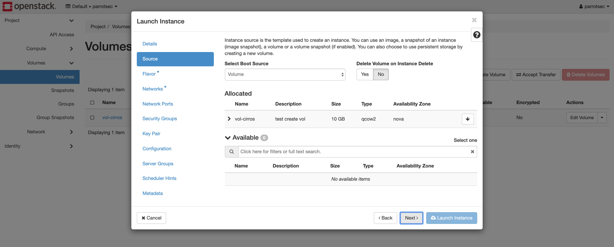

b3: flavo teamplate

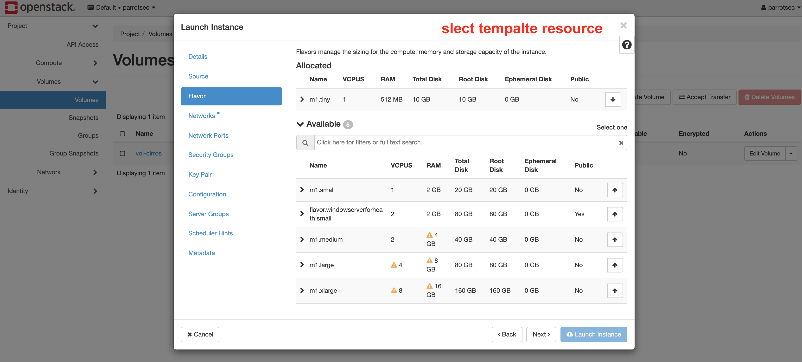

b4: select network interface

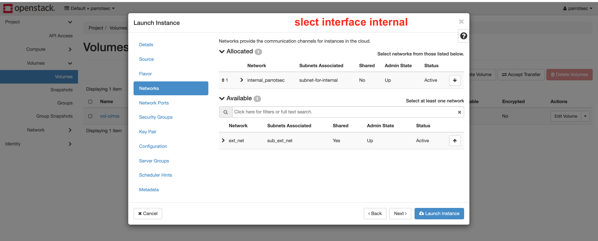

b5: select key pairs

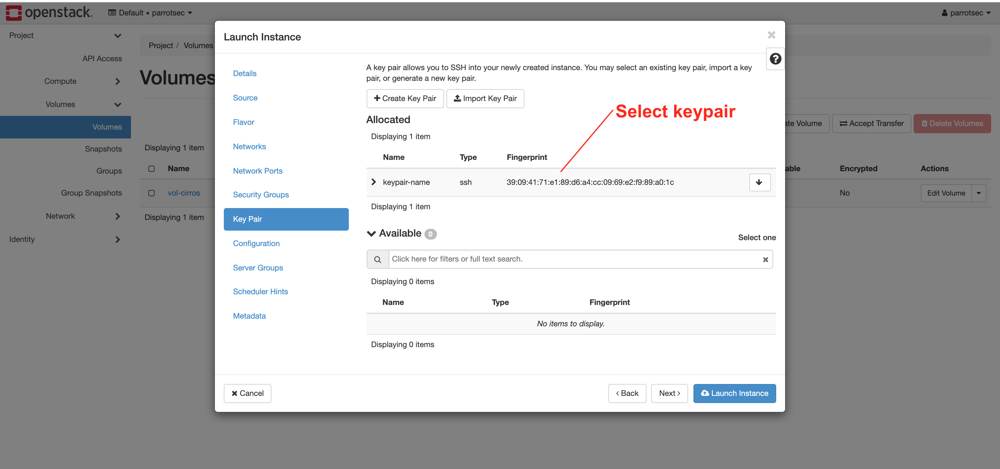

b6: select security group

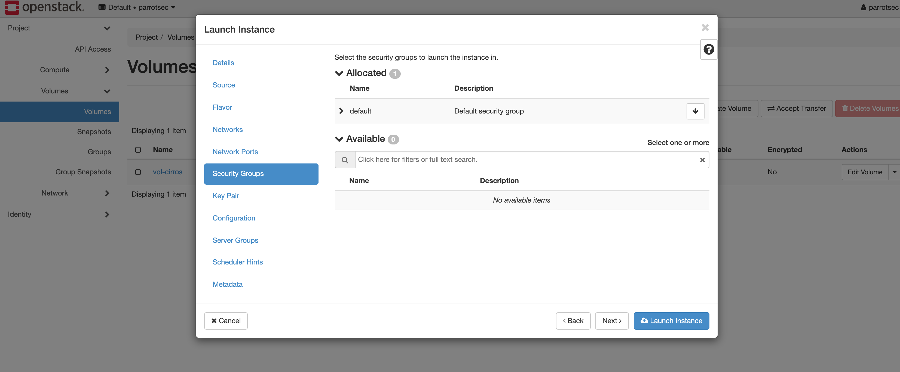

the end click Launch Instance

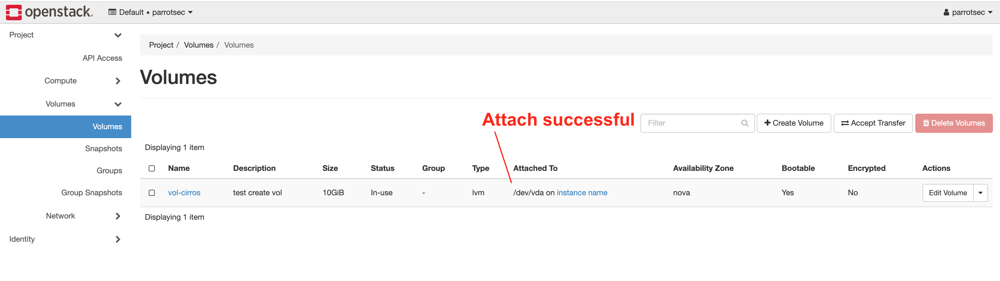

#### list instance : Project -> Compute -> instances

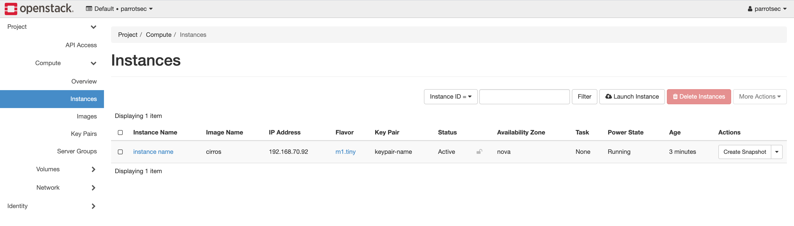

## Attach public ip

- floating ip

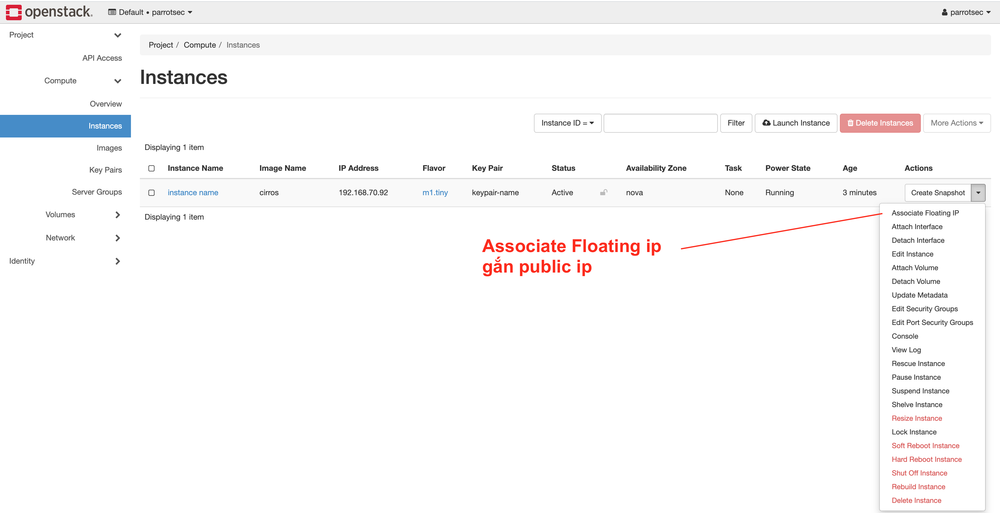

- slect public ip floating to interface

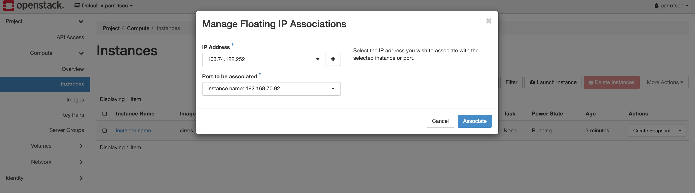


##### then, you connect ssh to server by public ip: ssh ubuntu@public_id
